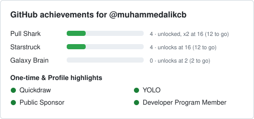

# gh-achievements

[](https://github.com/muhammedalikcb/gh-achievements/actions/workflows/build.yml)
[](LICENSE)


[English](README.md) · **Türkçe**

GitHub profilinde, yaptığın işlere göre kazandığın küçük rozetler var: Pull Shark, YOLO, Quickdraw, Starstruck gibi. Bunlara **achievement** deniyor. GitHub sana hangi rozetleri aldığını gösteriyor, ama bir sonrakine ne kadar kaldığını ve onu nasıl alacağını söylemiyor.

`gh-achievements` tam olarak bunu yapıyor. GitHub API'sine bakıp sana "Pull Shark x2 için 12 merge edilmiş PR daha lazım" gibi net bir durum raporu veriyor, yanına da bir sonraki adım için kısa bir ipucu ekliyor.



## Neler yapabiliyor?

- **Terminal raporu:** Renkli, okunması kolay bir ilerleme tablosu. İstersen JSON ya da Markdown çıktısı da alabilirsin.
- **Profil kartı:** Profil README'ne koyabileceğin bir SVG kart. Açık ve koyu temaya kendiliğinden uyum sağlıyor.
- **GitHub Action:** Kartını her gün otomatik güncelliyor, senin bir şey yapmana gerek kalmıyor.
- **Rozet rehberi:** Bütün rozetler, kademeleri, nasıl kazanıldıkları, ipuçları ve sık sorulan sorular tek bir yerde: [docs/ACHIEVEMENTS.tr.md](docs/ACHIEVEMENTS.tr.md).
- **Türkçe ve İngilizce:** Bilgisayarın Türkçe ise çıktı otomatik Türkçe geliyor. İstersen `--lang` ile kendin seçebilirsin.

## Kurulum

İki şeye ihtiyacın var:

1. **JDK 17 veya üstü.** `java -version` ile kontrol edebilirsin. macOS'ta `brew install openjdk@17` ile kurulur.
2. **Bir GitHub token'ı.** [GitHub CLI](https://cli.github.com/) kullanıyorsan ve `gh auth login` ile giriş yaptıysan ekstra bir şey yapmana gerek yok, araç token'ı oradan alıyor. Kullanmıyorsan `GITHUB_TOKEN` ortam değişkenine bir token yazman yeterli. Public veriler için ek yetkisi olmayan bir token iş görüyor.

Sonra:

```bash
git clone https://github.com/muhammedalikcb/gh-achievements.git
cd gh-achievements
./gradlew installDist
alias gh-achievements="$PWD/build/install/gh-achievements/bin/gh-achievements"
```

Son satırdaki `alias`'ı `~/.zshrc` dosyana eklersen her terminalde kısa adıyla çalıştırabilirsin.

## Kullanım

```bash
gh-achievements                  # kendi hesabın
gh-achievements torvalds         # başka bir kullanıcı
gh-achievements ali ayse         # birden fazla kişiyi karşılaştır
gh-achievements catalog          # bütün rozetler ve nasıl kazanılacakları
```

Örnek çıktı:

```
@muhammedalikcb için GitHub rozetleri

Kademeli
  Pull Shark     ██░░░░░░░░  4 merge edilmiş PR         açıldı, x2 için 16 (12 kaldı)
    → Zaten kullandığın projelerde küçük düzeltmeler ara: kırık linkler, eskimiş dokümanlar, ...
  Starstruck     ██░░░░░░░░  4 yıldız (tek repoda)      16 olunca açılır (12 kaldı)  muhammedalikcb/securecheck
  Galaxy Brain   ░░░░░░░░░░  0 kabul edilen cevap       2 olunca açılır (2 kaldı)

Tek seferlik
  ✔ Quickdraw            bir issue ya da PR'ı 5 dakika içinde kapattı
  ✔ YOLO                 review almadan PR merge etti
  ✔ Public Sponsor       herkese açık olarak birine sponsor
  ? Pair Extraordinaire  API'den okunamıyor, profilinden kontrol et

Profil rozetleri
  ✔ Developer Program Member
  ✘ Security Bug Bounty Hunter
  ...
```

Ne anlama geliyor?

- **Kademeli rozetler** belli sayılara ulaştıkça seviye atlıyor. Örneğin Pull Shark 2 PR'da açılıyor, 16'da bronz (x2), 128'de gümüş (x3), 1024'te altın (x4) oluyor. Çubuk, bir sonraki kademeye ne kadar yaklaştığını gösteriyor.
- **Tek seferlik rozetler** bir kez kazanılıyor, kademesi yok.
- **Profil rozetleri** achievement değil ama profilinde görünen özel işaretler, örneğin Developer Program üyeliği.
- **→ ile başlayan satırlar** bir sonraki adım için ipucu. İstemezsen `--no-tips` ile kapatabilirsin.

### Seçenekler

| Seçenek | Ne işe yarar |
| --- | --- |
| `-f, --format text\|json\|markdown\|svg` | Çıktı biçimi, varsayılan `text` |
| `--json` | `--format json` ile aynı |
| `-l, --lang en\|tr` | Dil, varsayılan olarak bilgisayarının dilinden seçilir |
| `-o, --output <dosya>` | Terminal yerine dosyaya yazar |
| `--theme auto\|light\|dark` | SVG kartın teması, `auto` bakan kişinin temasına uyar |
| `--no-tips` | İpuçlarını gizler |
| `--no-color` | Renksiz çıktı (`NO_COLOR` ortam değişkeni de çalışır) |

## Profiline rozet kartı ekle

GitHub'da kullanıcı adınla aynı isimde bir repo açarsan (örneğin `ali/ali`), o reponun README'si profil sayfanın en üstünde görünür. Kartı oraya koyabilirsin ve her gün kendiliğinden güncellenir.

1. Profil repona [examples/profile-card.yml](examples/profile-card.yml) dosyasını `.github/workflows/achievements.yml` adıyla ekle.
2. Türkçe kart istiyorsan dosyadaki `# lang: tr` satırının başındaki `#` işaretini sil.
3. README'ne şu satırı ekle:

   ```markdown
   
   ```

4. Reponun **Actions** sekmesinden "Update achievements card" iş akışını bir kez elle çalıştır. Sonrasında her sabah kendisi çalışır ve sadece bir şey değiştiyse commit atar.

Action'ın ayarları:

| Ayar | Varsayılan | |
| --- | --- | --- |
| `username` | repo sahibi | Kimin kartı oluşturulacak |
| `output` | `achievements.svg` | Yazılacak dosya |
| `format` | `svg` | `svg`, `markdown` ya da `json` |
| `lang` | `en` | `en` ya da `tr` |
| `theme` | `auto` | `auto`, `light` ya da `dark` |
| `token` | `github.token` | GitHub API için token |

## Neleri kontrol ediyor?

| Rozet | Neye bakılıyor | Kademeler |
| --- | --- | --- |
| Pull Shark | Açtığın ve merge edilen pull request'ler | 2, 16, 128, 1024 |
| Starstruck | En çok yıldız alan reponun yıldız sayısı (fork'lar sayılmaz) | 16, 128, 512, 4096 |
| Galaxy Brain | Discussions'ta kabul edilen cevapların | 2, 8, 16, 32 |
| Quickdraw | 5 dakika içinde kapatılan bir issue ya da PR | |
| YOLO | Review almadan kendin merge ettiğin bir PR | |
| Public Sponsor | En az bir herkese açık sponsorluk | |
| Profil rozetleri | Developer Program, Bug Bounty Hunter, Campus Expert, GitHub Star | |

API'nin göremediği rozetler (Pair Extraordinaire, PRO, Security advisory credit) ve artık verilmeyenler de [Türkçe rozet rehberinde](docs/ACHIEVEMENTS.tr.md) anlatılıyor.

## Bilinen sınırlar

- **Pair Extraordinaire sayılamıyor**, çünkü GitHub API'si bir kullanıcının co-author olduğu commit'leri vermiyor.
- **Quickdraw ve YOLO** sadece son 100 PR ve issue'ya bakıyor.
- **Başkalarına bakarken** sadece public aktiviteleri görünüyor. Bu yüzden sayıları profillerinde gördüğünden düşük çıkabilir.
- **Kurallar resmi değil.** GitHub kesin kriterleri yayınlamıyor. Eşikler topluluğun gözlemlerine dayanıyor, özellikle [Schweinepriester/github-profile-achievements](https://github.com/Schweinepriester/github-profile-achievements) listesine. Bir şey değiştiyse issue açarsan çok sevinirim.

## Katkı

Hata bildirimleri, çeviriler ve yeni kontroller memnuniyetle karşılanır, ayrıntılar [CONTRIBUTING.md](CONTRIBUTING.md) dosyasında. Bütün rozet metinleri [`Catalog.kt`](src/main/kotlin/dev/kocabey/achievements/Catalog.kt) dosyasında duruyor. Bir açıklamayı düzeltmek ya da yeni bir dil eklemek için tek bakman gereken yer orası.

## Lisans

[MIT](LICENSE)
